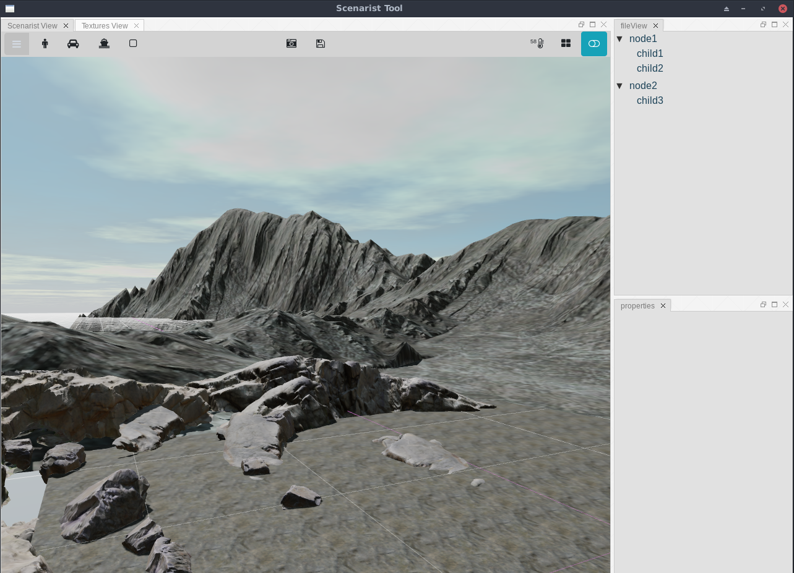

# nodelj

Nodelj is intended to be a luajit version of Nodejs. 

The current implementation is a base framework with some simple examples.

Current features:
- Webkit ffi library (currently Linux build - Win and OSX to be added)
- Interface to files for the Webkit engine.
- JavaScript interface for calling into Luajit.
- Luajit eval for accessing variables in JavaScript.
- Twig compatible templating (local and remote).

Standalone Luajit implementation which means:
- Access to a huge number of ffi libraries
- Use of standard Lua libraries
- Easy to add your own interfaces with ffi

## Usage

### Linux
Running a sample:
1. Set the project you wish to execute in the project/main.lua file.
2. Open terminal and cd to the root folder of the git project.
3. Run the following:
``` ./bin/linux/x64/luajit project/main.lua```

Various forms of execution are available:
- Local or combined Webkit pages using the "custom://" sceheme. Then scehem identifier can be modified as needed. 
- Remote links or a web browser styled application. Use the google config to see this in action. 
- Twig based templates combining the above. Make sure the twig template ends in the .twig extension. This can be modified if needed.

## Misc

The framework is being used in the creation of 3D tools for the web. Some example screenshots are shown below. 

Scenarist Tool - Saldo Pty Ltd


Sample use as a browser


Full Window WebGL Shader test


This work is based on the brilliant libraries and tools of:
- Luajit:                       https://luajit.org/
- Webview Lua ffi bindings:     https://github.com/webview/webview
- Aspect:                       https://github.com/unifire-app/aspect

Similar projects:
- Luakit: https://github.com/luakit-crowd/luakit


## License

The license is MIT. Please feel free to use personally or commercially.
Refer to the license file for details.